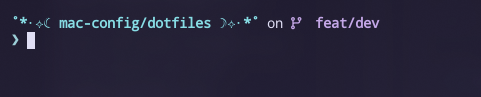

# MacBook Configuration

This repository simplifies the setup of your MacBook for development and deployment. It installs essential tools for Terraform, Ansible, Kubernetes, and containerization workflows.

Additionally, it includes dotfiles for a highly customized terminal and shell experience. 🌈

The provided script will automatically install all packages listed in the Brewfile, ensuring your system is equipped with the necessary tools for efficient deployments.

💡 Note: This Brewfile reflects my personal MacBook setup and includes additional software. If certain packages aren't needed, feel free to edit the Brewfile as explained in the [Brew Config documentation.](/mac-config/brew-config.md)

## Terminal customization

* Terminal: Wezterm 🖥️
* Shell: Fish 🐠
* Theme: Rosè Pine 🥀

Icons are managed with Starship. To display them correctly, install a [Nerdfont](https://www.nerdfonts.com/).

### Dot File Placements

| Name | Description |  Configlocation | Website |
| ---- | ----------- |  ----------- | ------- |
| wezterm | Terminal | ~/.wezterm.lua | https://wezfurlong.org/wezterm/installation.html |
| fish | Shell| ~/.config/fish/config.fish | https://fishshell.com/ |
| starship | Shell prompt| ~/.config/starship.toml | https://starship.rs/guide/ |
| k9s | Kubernetes management TerminalUI |tbd|tbd|

#### Custom Theme Preview:



## Brew packages installed

The following tools will be installed on your system, when running the brew file/script:
<details open>
<summary> General </summary>

    - direnv
    - mage
    - opentofu
    - pipx
    - docker
    - podman
    - podman-compose
    - terraform
    - tflint
    - vault
    - powershell
    - azure-cli
</details>

<details open>
<summary> Kubernetes related </summary>

    - helm
    - kind
    - kubernetes-cli
    - k9s
</details>

### Python Packages for Ansible

The following Python packages will be injected to the python environment for ansible:
<details open>

    - hvac
    - requests
    - pyvmomi
    - pywinrm
</details>

### Customizing the Brew File
For more informations, see [Brew Config documentation](/mac-config/brew-config.md).

## Getting Started
Clone the repository:

````shell
git clone https://github.com/yahikii/macbook-config.git
cd macbook-config
````

Install the Brewfile 
````shell
brew bundle --file=./Brewfile
````